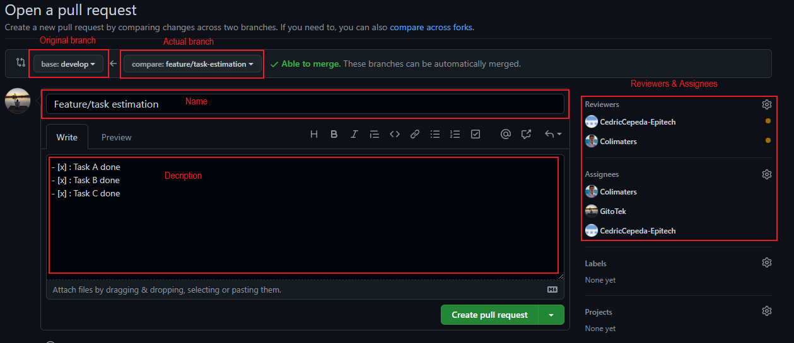
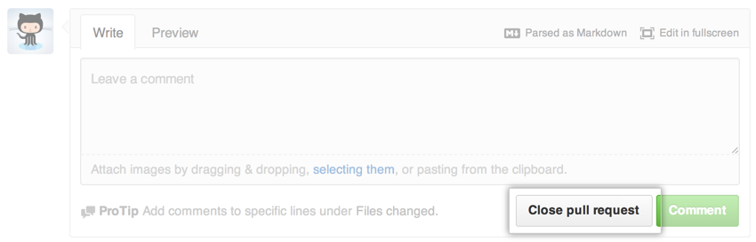

# Code reviews

## Table of content
* [Home](/README.md)
* [Tasks estimation in SCRUM](/readme-content/tasks-estimation.md)
* [Coding standards](/readme-content/coding-standards.md)
* [Code reviews](/readme-content/code-reviews.md)
    * [Pull request](#pull-request)
    * [What is a pull request](#what-is-a-pull-request-br)
        * [Git context](#git-context)
        * [Pull request definition](#pull-request-definition)
        * [How to make a good PR](#how-to-make-a-good-pr)
    * [How to do a good review ?](#how-to-do-a-good-review)
        * [How to prepare the review](#how-to-prepare-the-review)
        * [Best practice for a good review](#best-practice-for-a-good-review)
    * [Closing a pull request](#closing-a-pull-request-br)
        * [When to close a pull request](#when-to-close-a-pull-requestbr)
        * [How to close a pull request](#how-to-close-a-pull-requestbr)
    * [References](#references)
* [The link between the tree topics](/readme-content/topics-link.md)
* [Our project retrospective](/readme-content/project-retrospective.md)

 
Code reviews are essential for the good development of a Softare products. In this section, we will go through the best habits to make a good code review, using <b>pull requests</b>.   

## Pull request

Every merge to develop MUST go through a PR  
A lead dev or an architect will review your code and make some comment to it.  
The purpose of it is to keep the code quality as good as possible.

## What is a pull request?  

### Git context 

When developping in a team, people save their code in a common code history system: <b>git</b>. 
On this git, developers create different <b>branches</b>. A branch is a copy of an original code version, on which you develop on a specific feature/fix.  
Once done, the branch is <b>merged</b> back to the original one, to add the work to to original version of code. 
It enables developers to work on the same files without corrupting them, by merging works one by one.  

### Pull request definition

Paraphrasing Nelis (2017), a pull request is <b>"a mechanism for a developer to notify team members that a feature or fix, developed on a separate branch, is ready".</b> 
When a pull request is created by one developer, other developers are assigned to look at the work, give comments, and refuse or validate it. 
A pull request has a name and a description of the tasks done. 

 

If the pull request is refused, the developer at the origin of the pull request has to fix the indicated problems, before asking for a new pull request. 
If validated, the branch is merged to the original one and the developer can do the same scenario for another feature/fix.  

### How to make a good PR

1. Create a PR
    *  Go through your gitlab project > Merge Request > New Merge Request
    * Select your source branch and the branch develop.

2. PR Content
    * Set an explicit title
    * Write a description explaining :
        1. What’s the purpose of the code you are asking to merge
        2. The operations if the code is complex
        3. The choices you made in term of code architecture, technology, … if you made one
        4. Any information you thing the reviewer must know about your code

3. Reviewers and Assignee
    * Feel free to assign it to the most competent person for this PR.

4. Merge options
    * Always delete your branch, it avoid complex git manipulations
    * Do not check “Squash commit“ unless you have done tons of useless commits

If you have pipelines error, your PR won’t be approved except for specific reasons that you have to explain in the description.

For further information : https://betterprogramming.pub/how-to-make-a-perfect-pull-request-3578fb4c112

## How to do a good review

Code reviews are made to have a better code
And doing better code reviews makes for even better code!
Let's see how to make code reviews more efficient

### How to prepare the review

1. The important questions to have in mind
    * Do I understand what the code does?
    * Does the code function as I expect it to?
    * Does this code fulfill regulatory requirements?

2. What to look in the code
    * Structure
    * Style
    * Logic
    * Performance
    * Test coverage
    * Design
    * Readability
    * Functionality

### Best practice for a good review

1. Build & Run the program
    * You can see how the program works
    * This allows you to ensure that the code works as intended

2. Don't review for more than 60 minutes
    * After this time, your concentration will no longer be maximal
    * Taking breaks allows you to return to the review with a clearer mind

3. Check no more than 400 lines at a time
    * After this limit, it will be more complicated to find errors

4. Give feedbacks
    * Don't be insulting or judgmental !
    * Be constructive by asking question
    * Honored the good things in the code

For more information you can find these following articles:
- https://www.perforce.com/blog/qac/9-best-practices-for-code-review
- https://betterprogramming.pub/5-practices-to-give-great-code-review-feedback-6b1a9196a716

## Closing a pull request  

Created pull request are not always accepted and merged as they don't meet requirements. 
In this section, we will discuss the best habits for closing a pull request. 

### When to close a pull request 

There are different scenarios for closing a pull request: 

* <b>The feature/fix is uncomplete</b> 
In this situation, you must discuss in the description/comments with the developer(s) why the pull request has been refused, according to the feature plan, and why it must be fixed before asking a new one.
* <b>The code does not pass continuous integration tests</b> 
In this situation, you must pinpoint the tests that encountered a failure and ask for a new pull request with successful tests.
* <b>The project does not accept any further changes</b> 
In this situation, you can close the pull request, indiciting that the project refuses future changes (the README.md must indicate this too).
* <b>Virulent debate on accepting/refusing the pull request</b> 
If a developper does not recognize its mistakes and keep discussing about it, you must close the pull request in order to keep a good work atmoshpere, and wait for a new one with the discussed fixes.

### How to close a pull request 

It is pretty simple to close a pull request. Using github for example, you just have to click on <b>"Close pull request"</b> at the bottom of the pull request, after leaving a comment detailling the reasons. 

  

## References

- Article by Mike McQuaid, 15 March 2016, "Kindly Closing Pull Requests"
    - https://github.blog/2016-03-15-kindly-closing-pull-requests/
- Article by Github, Unknown date, "Closing a pull request"
    - https://docs.github.com/en/pull-requests/collaborating-with-pull-requests/incorporating-changes-from-a-pull-request/closing-a-pull-request

## References

- Article by Nelis, 04 October 2017, "Why and how do we use pull request?"
    - https://co-learning.eu/2017/10/04/why-and-how-do-we-use-pull-request/
