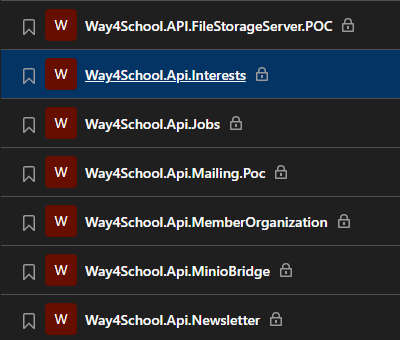
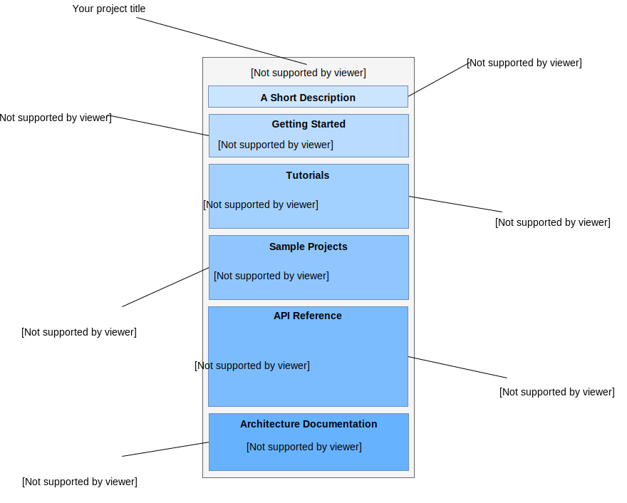
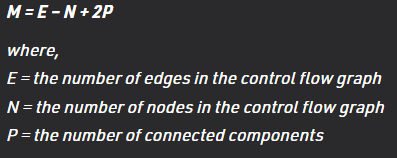
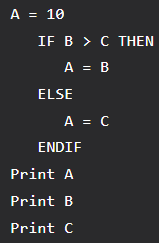
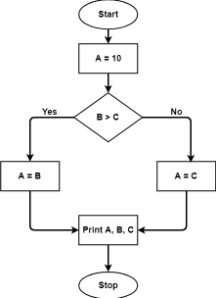

# Coding standards

## Table of content
* [Home](/README.md)
* [Tasks estimation in SCRUM](/readme-content/tasks-estimation.md)
* [Coding standards](/readme-content/coding-standards.md)
    * [Introduction](#introduction)
    * [Repository name and branch description](#repository-name-and-branch-description)
    * [Different code norms](#different-code-norms)
        * [The goal](#the-goal)
        * [The rules](#the-rules)
    * [Code documentation](#code-documentation)
    * [Work with cyclomatic complexity](#work-with-cyclomatic-complexity-br)
        * [Quick definition](#quick-definitionbr)
        * [How to evaluate it](#how-to-evaluate-itbr)
        * [How to work with too complex code](#how-to-work-with-too-complex-codebr)
    * [Coverage tests](#coverage-tests-br)
        * [The different tests](#the-different-testsbr)
        * [How to evaluate it](#how-to-evaluate-itbr)
    * [Articles references](#references)
* [Code reviews](/readme-content/code-reviews.md)
* [The link between the tree topics](/readme-content/topics-link.md)
* [Our project retrospective](/readme-content/project-retrospective.md)

## Introduction

There are coding standards to make it easier for members of the same organization or outsiders to understand each other's work. It is very important to always keep in mind that a good quality code is a code readable by all. 

##  Repository name and branch description

It is very common to find dozens of projects within the same organization. Each project often feeds a larger project, so the question is how to deal with all the projects. 
Here is an example of one of my GIT with a multitude of projects 
 
The nomenclature we have decided upon is as follows : OrganisationName.ProjectType.ProjectName.Specificity

Now that we have the repository, let's talk about branch management. 
The one we will use will follow the gitflow system:

**Branch description**
* main
    * Default branch
    * Used in production
    * Merge to this branch is only allowed to lead devs and architects
* develop
    * Branch used to merge features
    * Used in develop environment
    * Merge in tis branch is allowed to everyone through a pull request
* release/v<major.minor.revision>
    * Branch used to fix the service before sending it to main
    * Used in QA environment
    * Branch creation is allowed to everyone
* "dev-type"/"workitem-id"-"feature-name"
    * Branch used to develop
    * Not used in any environment

This function is used in a personal way for more information go here : 
 https://jfrog.com/whitepaper/best-practices-structuring-naming-artifactory-repositories/

## Different code norms

The coding rules are decided according to the needs of the company and the languages.

### The goal

Having rules to code allows to have a uniform code for all developers.
This makes it easier to read during reviews and increases maintainability.
Code can be more easily reused and errors much more easily detected.
Finally, the efficiency of the team is improved.

### The rules

Below is a non-exhaustive list of the most commonly used rules

1. Naming conventions for variables and function

    * Have meaningful variable names.
    * Avoid numbers in variable names
    * Have explicit function names with a verb

2. Identation

    Indentation concerns the number of spaces (or tabs) in a function or an if, while statement and even the spaces to put between 2 arguments of a function.
    
    For example, the braces that can be on a new line and the block of code that follows that must be on a new line too
3. Length of function

    Having short functions makes the program more structured and easier to read.
    Short functions with explicit names make debugging and code review much faster
4. Not use the GOTO keyword
    
    This keyword makes the program difficult to understand and follow. Debugging becomes much more complicated

For further information : https://www.geeksforgeeks.org/coding-standards-and-guidelines/

## Code documentation

Writing code documentation is not an easy task but it is very important.
Whether it is for other developers who will use your code or even for you later when you have to proofread it.

Each part of a project documentation is important and has its role.

 

* The short description allows the person who will read your code to know right away what it is used for.

* The Getting Started Guide should be accompanied by a basic example to show how your code works

* Tutorials should show examples of code with comments on the most likely use cases of the code

* The example projects show how an entire project using your code can work.

* The API documentation is the densest part to do but the most useful for other developers.
Every function, class, variable that can be used must be documented.
    
    Each element should be explained with a short description and if possible accompanied by a practical example

* The Architecture section is not as important as the previous sections but it is useful for people who could contribute to the project.

For further information : https://www.sohamkamani.com/blog/how-to-write-good-documentation/

## Work with cyclomatic complexity  

### Quick definition 

<b>Cyclomatic complexity</b> is a software metric that developer can use to indicate the complexity of a code section or an entire program. 
It can be understood as the number of linearly independent paths a code section has in it. 
E.g. a code with no flow statement has a <b>cyclomatic complexity of 1</b>. 
E.g. a code with one if condition has a <b>cyclomatic complexity of 2</b> as the result of a if condition can be true or false.  

### How to evaluate it 

According to akash1295 (2021), there is a simple formula to calculate the cyclomatic complexity of a code section: 

 

Example for a simple code section, the cyclomatic complexity is : 7 - 7 + 2 = 2 

 

### How to work with too complex code 

In case of a too complex code, you have several options of optimisation:
- remove duplicated/obsolete code
- smaller functions
- reduce the number of decision structures
- don't code methods from the framework you are using  

## Coverage tests  

Code coverage is one of the best metrics to assure the quality of your project.

### The different tests 

According to Sten Pittet there are 5 common metrics:  
- <b>Function coverage</b> - the number of functions called executed
- <b>Statement coverage</b> - the number of code statement executed
- <b>Branches coverage</b> - the number of the branches of the control structures executed
- <b>Condition coverage</b> - the number of boolean statement executed (true&false) 
- <b>Line coverage</b> - the number of lines of code tested 

 

### How to evaluate it 

There are many tools to run coverage tests, according to the language you are using: 
- Java: Atlassian Clover, Cobertura
- Javascript: istanbul, Blanket.js
- PHP: PHPUnit
- Python: Coverage.py 
- and more...

Each of these tools has its defaults and advantages. However, it depends to your team to define a coverage percentage to reach. 
A good habit is to define around a goal of 80% coverage, with a failure threshold around 70%. 
However it not all about the coverage percentage, it is about having a team understanding the results to anticipate future possible errors and realize quick fixes. Everyone must have a rigor about writing tests to ensure quality.  

## References

- Article by Sten Pittet, Unknown date, "An introduction to code coverage"
    - https://www.atlassian.com/continuous-delivery/software-testing/code-coverage
- Article by akash1295 - GeeksforGeeks, 21 June 2021, "Cyclomatic Complexity"
    - https://www.geeksforgeeks.org/cyclomatic-complexity/
    - https://linearb.io/blog/reduce-cyclomatic-complexity/
