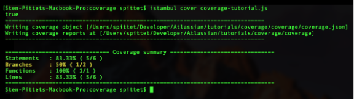

# Coding standards

## Table of content
* [Home](/README.md)
* [Tasks estimation in SCRUM](/readme-content/tasks-estimation.md)
* [Coding standards](/readme-content/coding-standards.md)
    * [Coverage tests](#coverage-tests-br)
* [Code reviews](/readme-content/code-reviews.md)
* [The link between the tree topics](/readme-content/topics-link.md)
* [Our project retrospective](/readme-content/project-retrospective.md)

## Coverage tests  

Code coverage is one of the best metrics to assure the quality of your project.

### The different tests 

According to Sten Pittet there are 5 common metrics:  
- <b>Function coverage</b> - the number of functions called executed
- <b>Statement coverage</b> - the number of code statement executed
- <b>Branches coverage</b> - the number of the branches of the control structures executed
- <b>Condition coverage</b> - the number of boolean statement executed (true&false) 
- <b>Line coverage</b> - the number of lines of code tested 

 

### How to evaluate it 

There are many tools to run coverage tests, according to the language you are using: 
- Java: Atlassian Clover, Cobertura
- Javascript: istanbul, Blanket.js
- PHP: PHPUnit
- Python: Coverage.py 
- and more...

Each of these tools has its defaults and advantages. However, it depends to your team to define a coverage percentage to reach. 
A good habit is to define around a goal of 80% coverage, with a failure threshold around 70%. 
However it not all about the coverage percentage, it is about having a team understanding the results to anticipate future possible errors and realize quick fixes. Everyone must have a rigor about writing tests to ensure quality.  

## References

- Article by Sten Pittet, Unknown date, "An introduction to code coverage"
    - https://www.atlassian.com/continuous-delivery/software-testing/code-coverage