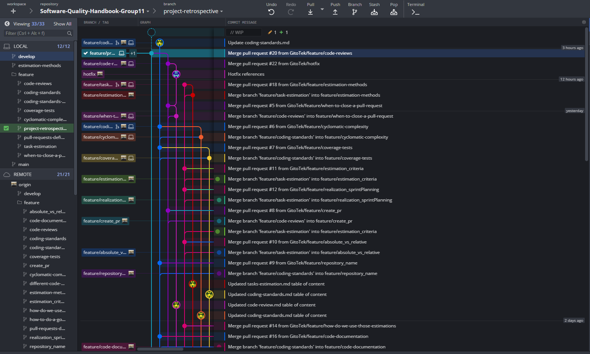

# Our project retrospective

## Table of content
* [Home](/README.md)
* [Tasks estimation in SCRUM](/readme-content/tasks-estimation.md)
* [Coding standards](/readme-content/coding-standards.md)
* [Code reviews](/readme-content/code-reviews.md)
* [The link between the tree topics](/readme-content/topics-link.md)
* [Our project retrospective](/readme-content/project-retrospective.md)

## Global retrospective

This project has been a very interesting project for the three of us. 
We had a really good plan and followed it nicely. We had a nice usage of branches as the next gitkraken screenshot shows. 

 

## Cedric retrospective

* **What was good**
    * A good distribution of tasks
    * Good compliance with development practices
* **What could have been better**
    * Could have better explanation globally
    * Could have created more diagrams of my own

## Darius retrospective

* **What was good**
    * ...
* **What could have been better**
    * ...

## Thibaut retrospective

* **What was good**
    * Very nice tasks distribution / plan
    * Nice communication between the team
    * Nice usage of branches and pull requestrs

* **What could have been better**
    * Personally, at the start of the project I gave wrong branches name, I won't do that again