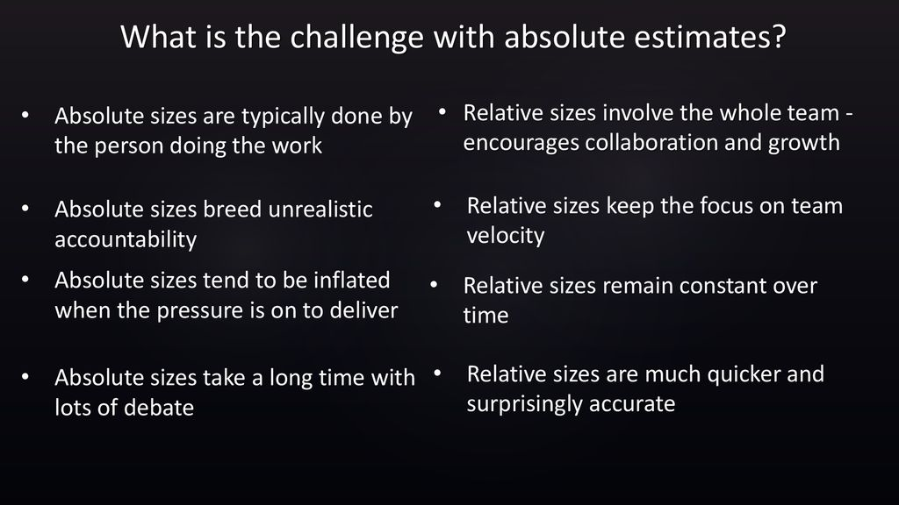
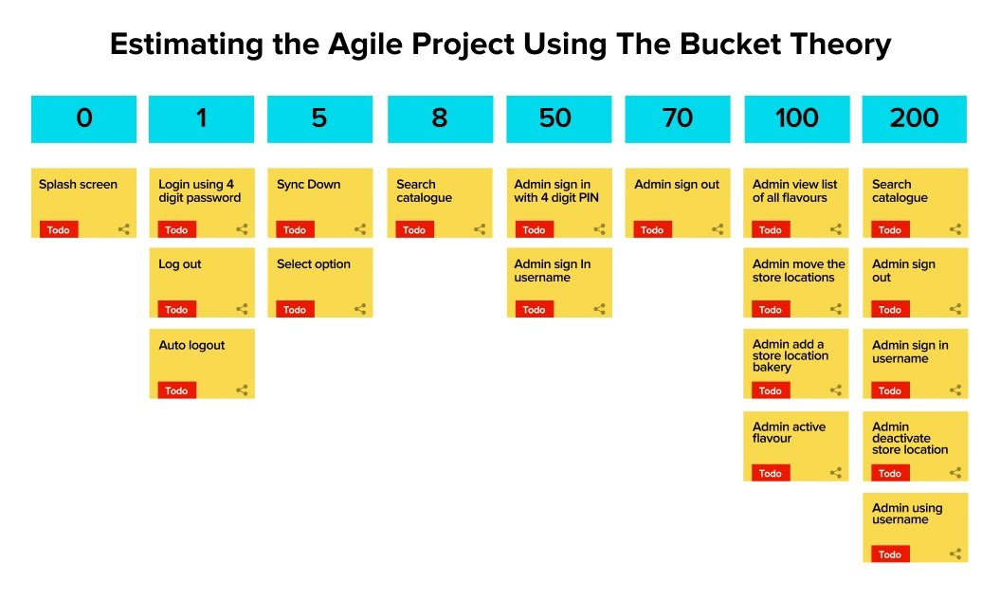
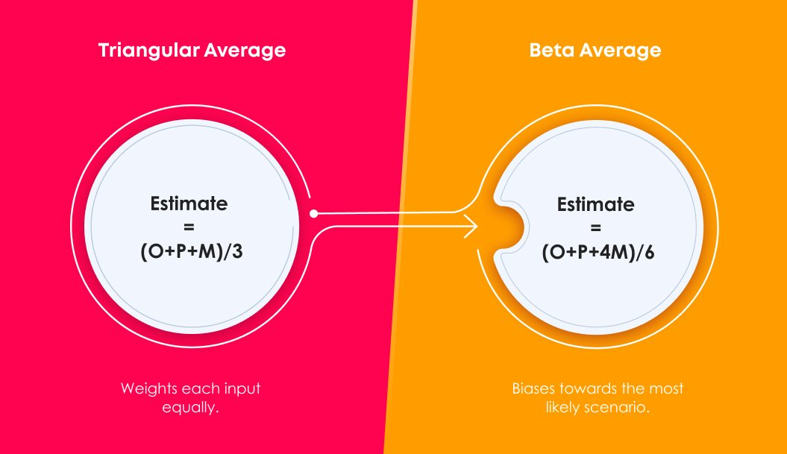
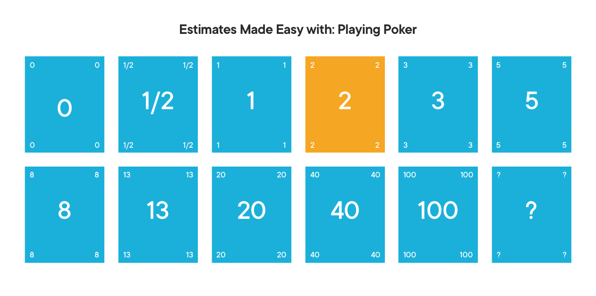

# Tasks estimation in SCRUM

## Table of content
* [Home](/README.md)
* [Tasks estimation in SCRUM](/readme-content/tasks-estimation.md)
    * [Introduction](#introduction)
    * [Absolute vs relative estimation](#absolute-vs-relative-estimation)
    * [References](#references)
* [Coding standards](/readme-content/coding-standards.md)
* [Code reviews](/readme-content/code-reviews.md)
* [The link between the tree topics](/readme-content/topics-link.md)
* [Our project retrospective](/readme-content/project-retrospective.md)

## Introduction

Task estimation is at the very root of project planning. In an agile world how are we supposed to estimate our tasks.

## Absolute vs relative estimation

There are two types of estimation, the most known and unfortunately still the most used is the absolute estimation. It simply consists in estimating a task in terms of hours of development required.  
 
As you can see from the illustration it is almost impossible to estimate a task accurately. One of the biggest issue of absolute estimation is dates have an emotional attachment to them. Relative estimation removes the emotional attachment.  
 
To counter this problem in agile we use relative estimation, which means giving a weight to a task without providing a precise estimate.
 

## The different estimation methods - Why do we prefer Fibonacci ?

 There are different estimation methods that can be userd for software projects. Here is a list of the ones we prefer: 

### The Bucket System Estimation

This method is pretty simple. Each member of the team discuss a number to assign to a task and place it under a "bucket". 
It is a nice method for quick estimations for a large number of items.

 

### Three-Point Method

With this method, we define the optimistic (O), pessimist (P) and most likely (ML) effort value to then calculate the average time using a formula. 
It is a nice method for teams new to agile. 
There are two different formulas: 

 

### Planning Poker with the Fibonacci sequence

For this method, each team member has cards with numbers from the result of a sequence of the summ of the previous two numbers. 
Each team member selects secretly a card and all cards are revealed at the same time. 
The card with the most voting is the finalized estimate. If the team can't agree, a meeting is done before a new vote. 
If the selected card ha a too high number the task will be splitted in different tasks for which there will be a vote. 

 

This method is the method we prefer because it is dynamic, it enables to have good estimates, split the too complicated tasks and moreover, everyone is concerned by each tasks. 

## References

- Article by Ashish Dhawan, 20 April 2021, "Top 8 Agile Estimation Techniques"
    - https://www.netsolutions.com/insights/how-to-estimate-projects-in-agile/
- Article by Dan Radigan, Unknown date, "Story points and estimation"
    - https://www.atlassian.com/agile/project-management/estimation
- Article by Daria Bagina, 21 May 2021, "Are your estimates really agile ?"
    - https://scrummastered.com/blog/are-your-estimates-really-agile/
