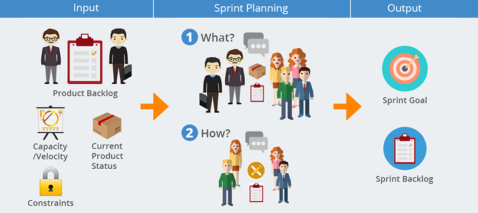

# Tasks estimation in SCRUM

## Table of content
* [Home](/README.md)
* [Tasks estimation in SCRUM](/readme-content/tasks-estimation.md)
    * [How to realize a sprint planning?](#how-to-realize-a-sprint-planning)
* [Coding standards](/readme-content/coding-standards.md)
* [Code reviews](/readme-content/code-reviews.md)
* [The link between the tree topics](/readme-content/topics-link.md)
* [Our project retrospective](/readme-content/project-retrospective.md)

## The different estimation methods - Why do we prefer Fibonacci ?

 There are different estimation methods that can be userd for software projects. Here is a list of the ones we prefer: 

### The Bucket System Estimation

This method is pretty simple. Each member of the team discuss a number to assign to a task and place it under a "bucket". 
It is a nice method for quick estimations for a large number of items.

 

### Three-Point Method

With this method, we define the optimistic (O), pessimist (P) and most likely (ML) effort value to then calculate the average time using a formula. 
It is a nice method for teams new to agile. 
There are two different formulas: 

 

### Planning Poker with the Fibonacci sequence

For this method, each team member has cards with numbers from the result of a sequence of the summ of the previous two numbers. 
Each team member selects secretly a card and all cards are revealed at the same time. 
The card with the most voting is the finalized estimate. If the team can't agree, a meeting is done before a new vote. 
If the selected card ha a too high number the task will be splitted in different tasks for which there will be a vote. 

 

This method is the method we prefer because it is dynamic, it enables to have good estimates, split the too complicated tasks and moreover, everyone is concerned by each tasks. 

## How to realize a sprint planning?

The sprint planning is the ceremony in scrum to estimate and define the tasks that will be addressed during the next sprint. 
In order for this event to take place in the best conditions it is necessary to have a detailed backlog. 
The team members then estimate each task to be performed. It is possible that some team members do not agree with the estimate. There should be a short time to discuss this difference. If the team does not agree on the estimate of a task, the highest estimate will prevail.  

To finish in SCRUM we focus on the elements that add the most value to the product. It is therefore logical to estimate and put in the backlog of the next sprint the tasks that have the greatest added value.

For more information you can find the following article:
https://www.atlassian.com/agile/scrum/sprint-planning#:~:text=Instead%20of%20building%20the%20most,on%20the%20sprint%20goal%20early

## References

- Article by Ashish Dhawan, 20 April 2021, "Top 8 Agile Estimation Techniques"
    - https://www.netsolutions.com/insights/how-to-estimate-projects-in-agile/
