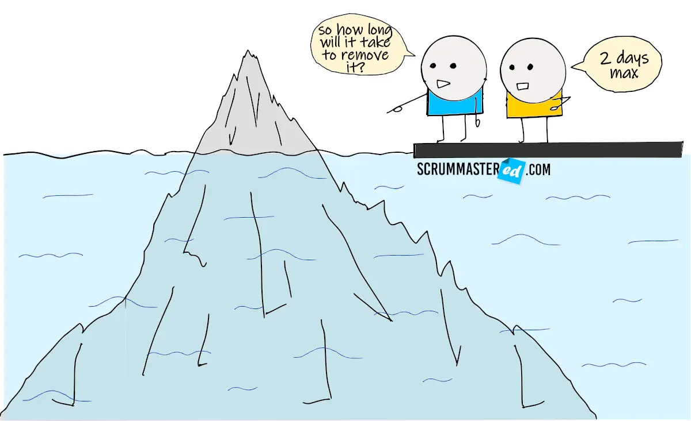

# Tasks estimation in SCRUM

## Table of content
* [Home](/README.md)
* [Tasks estimation in SCRUM](/readme-content/tasks-estimation.md)
    * [Introduction](#introduction)
    * [Absolute vs relative estimation](#absolute-vs-relative-estimation)
    * [What are estimation criterias? Which bad habits?](#what-are-estimation-criterias-which-bad-habits)
    * [How to use those estimations](#how-to-use-those-estimations)
        * [What is the velocity](#what-is-the-velocity)
        * [Representation of this estimate](#representation-of-this-estimate)
    * [How to realize a sprint planning?](#how-to-realize-a-sprint-planning)
    * [References](#references)
* [Coding standards](/readme-content/coding-standards.md)
* [Code reviews](/readme-content/code-reviews.md)
* [The link between the tree topics](/readme-content/topics-link.md)
* [Our project retrospective](/readme-content/project-retrospective.md)

## Introduction

Task estimation is at the very root of project planning. In an agile world how are we supposed to estimate our tasks.

## Absolute vs relative estimation

There are two types of estimation, the most known and unfortunately still the most used is the absolute estimation. It simply consists in estimating a task in terms of hours of development required.  
 
As you can see from the illustration it is almost impossible to estimate a task accurately. One of the biggest issue of absolute estimation is dates have an emotional attachment to them. Relative estimation removes the emotional attachment.  
 
To counter this problem in agile we use relative estimation, which means giving a weight to a task without providing a precise estimate.
 

## What are estimation criterias? Which bad habits?

In order to correctly estimate a task it is essential to have the following criteria that will define the complexity of the work:
- Work complexity
- The amount of work
- Risk or uncertainty

These three factors are the key elements to keep in mind when estimating. Errors in relative estimation are not without error. Here are 3 examples of errors not to be reproduced
1. Measuring Productivity by Points
    * When we estimate tasks with points it is abstract. Each team has a different vision than the other. It is therefore important not to compare the productivity of a team based on the number of story points completed in a sprint.
2. Equating Points With Hours or Days
    * For teams starting out in agility, the most common mistake is to simplify the number of points to a number of hours spent in development. It is important to understand that there is no formula for converting points to development hours.
3. Failing to Learn
    * When we talk about agility, it necessarily includes the notion of learning. It is essential to be able to learn from past mistakes and successes in order to correct them or continue them.

## How to use those estimations

Estimations are key metrics to have data related to the team's performance in a sprint.
And the example we will talk about is the velocity.

### What is the velocity

Velocity represents how fast the team can solve stories in the backlog in different sprints.
This data is used only for the team and is not intended to be shared.
To have a good representation of the velocity, it must be calculated over several sprints.
The results become relevant with 3 completed sprints.

### Representation of this estimate

Here is a representation of the velocity.
This graph represents the planned work and the completed work over 5 sprints.

 

For further information : https://www.workfront.com/project-management/methodologies/agile/velocity

## The different estimation methods - Why do we prefer Fibonacci ?

 There are different estimation methods that can be userd for software projects. Here is a list of the ones we prefer: 

### The Bucket System Estimation

This method is pretty simple. Each member of the team discuss a number to assign to a task and place it under a "bucket". 
It is a nice method for quick estimations for a large number of items.

 

### Three-Point Method

With this method, we define the optimistic (O), pessimist (P) and most likely (ML) effort value to then calculate the average time using a formula. 
It is a nice method for teams new to agile. 
There are two different formulas: 

 

### Planning Poker with the Fibonacci sequence

For this method, each team member has cards with numbers from the result of a sequence of the summ of the previous two numbers. 
Each team member selects secretly a card and all cards are revealed at the same time. 
The card with the most voting is the finalized estimate. If the team can't agree, a meeting is done before a new vote. 
If the selected card ha a too high number the task will be splitted in different tasks for which there will be a vote. 

 

This method is the method we prefer because it is dynamic, it enables to have good estimates, split the too complicated tasks and moreover, everyone is concerned by each tasks. 

## How to realize a sprint planning?

The sprint planning is the ceremony in scrum to estimate and define the tasks that will be addressed during the next sprint. 
In order for this event to take place in the best conditions it is necessary to have a detailed backlog. 
The team members then estimate each task to be performed. It is possible that some team members do not agree with the estimate. There should be a short time to discuss this difference. If the team does not agree on the estimate of a task, the highest estimate will prevail.  

To finish in SCRUM we focus on the elements that add the most value to the product. It is therefore logical to estimate and put in the backlog of the next sprint the tasks that have the greatest added value.

For more information you can find the following article:
https://www.atlassian.com/agile/scrum/sprint-planning#:~:text=Instead%20of%20building%20the%20most,on%20the%20sprint%20goal%20early

## References

- Article by Ashish Dhawan, 20 April 2021, "Top 8 Agile Estimation Techniques"
    - https://www.netsolutions.com/insights/how-to-estimate-projects-in-agile/
- Article by David Green, July 9 2014, "Do You Make These 7 Agile Estimation Mistakes?"
    - https://www.sitepoint.com/make-7-mistakes-agile-estimation/
- Article by Dan Radigan, Unknown date, "Story points and estimation"
    - https://www.atlassian.com/agile/project-management/estimation
- Article by Daria Bagina, 21 May 2021, "Are your estimates really agile ?"
    - https://scrummastered.com/blog/are-your-estimates-really-agile/